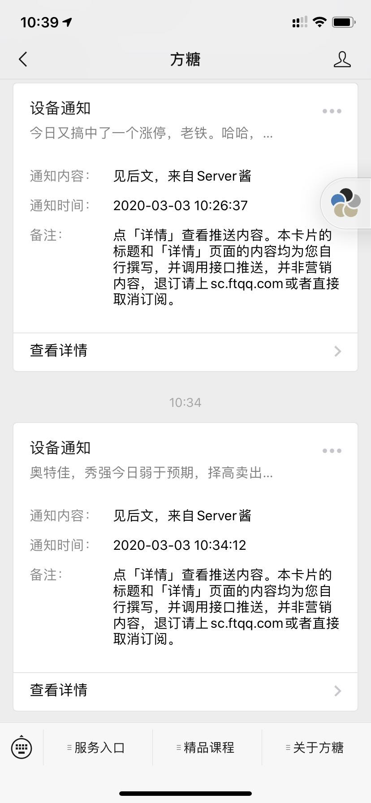

# CrawlWeibo

Crawl Someone's Weibo text (for quick get and quickview )

爬取某个人的微博最新内容，并发送到微信端，方便快速获取，不必一直刷微博

（笔者是为了偷懒不想刷微博，不想影响工作状态，又想快速实时获取某炒股博主的最新weibo）

---

- 前期参数准备
   - 发送给微信端采用[【server酱】](http://sc.ftqq.com/3.version)进行微信信息端发送，在server 酱中获取SCKEY参数
   - 爬取某个人的微博时，需先去weibo获取网页链接 如 
   ``https://weibo.com/p/1005051646174132/home?from=page_100505_profile&wvr=6&mod=data&is_all=1#place``
   
- 如果使用（how to use）
    - 将代码打成jar包，直接在jdk环境中执行，java -jar
    - 在服务器本地调用 
        - localhost:11176/crawl/weiBo 为单次获取
        - localhost:11176/crawl/weiBo/keep 为持续获取，每隔10分钟查看一次
    - 参数为ParamDto
        - 示例：
        ```{"userUrl":"https://weibo.com/p/1005051646174132/home?from=page_100505_profile&wvr=6&mod=data&is_all=1#place","weChatUrl":"https://sc.ftqq.com/SCU40692Tccb6b97f9f07146f0b5ac909ca1bfcf35c3c6e3cd17d2.send?text="}```
- 效果图
    - 
***
- 后续
    - 期待做成通过OAuth授权调用weibo api的做法来获取用户微博内容
    - 功能简单，还有更多不完善的期待一起完善

- 致谢
    -    [【server酱】](http://sc.ftqq.com/3.version)
    
- 赞赏
    - 
